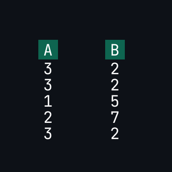
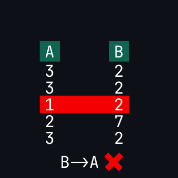
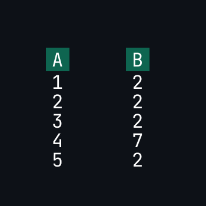
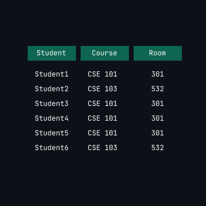
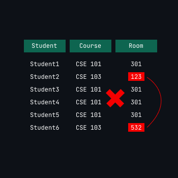
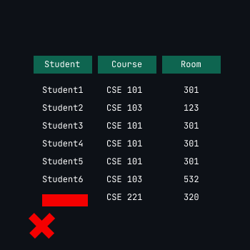
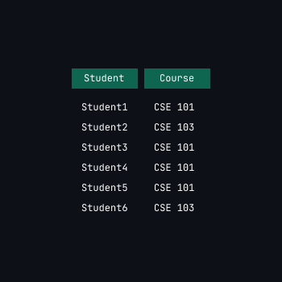
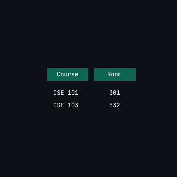
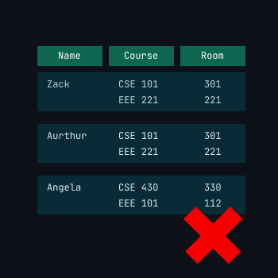
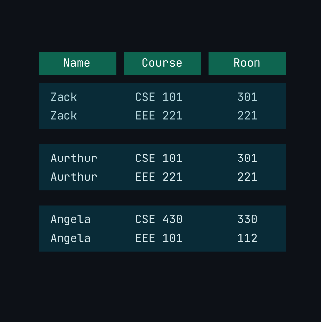

## Functional Dependency
[Youtube Lecture Followed](https://www.youtube.com/watch?v=dR-jJimWWHA) 
A->B 
*Reading : A determines B*   

means B(set of columns) dependent on A(set of columns)
- it also means that for all same values of A, B will contain same values. 
 
Here for all A=3 B =2 and rest are single entities so we can say they're same too. Therefore, its a valid FD. 
- A->B Doesn't mean that B->A 
 
here A->B is valid but B->A isn't. So it may be valid in some cases that is coincidental. 
- If A(determinant) values are all distinct then the FD is valid. For Example  
 

[Lecture Followed for Classification of FD and Armstrong's Axioms](https://www.youtube.com/watch?v=eIH7zRVelnw&list=PLdo5W4Nhv31b33kF46f9aFjoJPOkdlsRc&index=5)
## Trivial Functional Dependency
Let's say we have a FD A->B and B is subset of A then its trivial. 

A = {ID, Name}   
B = {Name} 
A->B is Trivial  
 
A = {ID} 
B = {ID} 
A -> B is Trivial 

- Trivial FD always valid.

## Armstrong's Axioms
- Reflexive Rule 
if B is subset of A then A->B (Trivial) 
- Augmentation Rule 
if A->X then AB -> XB 
- Transitivity Rule 
if A -> B  && B ->C then A -> C 

**Some Additional Rules**

- Union Rule 
if A -> B and A -> C then A -> BC 
- Decomposition / Splitting  
if X -> YZ then X->Y and X->Z 
but left hand side can't be splitted like this if XY -> MN then it can't be said that X->MN and Y -> N  
- Pseudotransitivity  
if X -> Y & YZ -> A then XZ -> A 
- Compose  
if X->Y & A->B then XA -> BY 

## Attribute Closure
set of all the attributes which can be determined from an attribute is called attribute closure.  
F = {A→B,
A→C,
CG → H,
CG → I,
B → H} 
Then $AG^+$ = AGBCHI = ABCGHI 

**Super Key** 
If an attribute's closure contains all the attributes then its a super key.
Above AG is a super key.

**Candidate Key** 
A super key whose proper subset attributes are not super key itself. 

**Prime Attribute** 
Attributes present in candidate key 
****
[Finding Candidate key](https://www.youtube.com/watch?v=L0LEtrIDYrE&list=PLdo5W4Nhv31b33kF46f9aFjoJPOkdlsRc&index=7) 
Steps to follow  
Question :  
A Relation given that R(A,B,C,D) 
FD :  
AB -> CD , D->B, C->A 

-   find closure of all the attributes together for example $ABCDE^+$ and we know it must be super key.ABCD is a super key which is obvious.  
$$ABCD^+ = ABCD (superkey) $$ 
- Now remove all the attributes that can be determined from other one. Consider all direct and indirect application of Armstrong's axiom and its additional rules. 
$$CD^+ = CDAB (superkey)$$
- Now what you got, check its proper subsets to ensure if its a candidate key or not. 
$$C^+ = AC$$
$$D^+ = BD$$
So, CD is a candidate key.
- If you get one candidate key, then write down the prime attributes.
$$Prime Attributes = C,D$$
- Check if Any of the prime attributes is present on the right side of any functional dependency or not. Place them in the present candidate key like this. 
From FD $AB->C$ 
we can write $CD = ABD$ and again step 1 we can get B from D so $AD$ might be a candidate key so check and keep going on this loop until you don't find any of prime attributes at the right of FD. 

# Normalization
[Lecture Followed](https://www.youtube.com/watch?v=p-j9emhNVTg&list=PLdo5W4Nhv31b33kF46f9aFjoJPOkdlsRc&index=9)  
process of organizing data in database to minimize redundency and dependency.

## Anomaly (Problems)
Mainly these are the problems we face for redundency in database. I tried to explain these below.  
 
this table has high redundency. We'll see what types of problems we face while dealing with this table. 

- Update Anomaly  
In this table, if we want to update the room for a course we have to update it for all instances where that course is present. Otherwise two instance will have separate room number. 
  

- Delete Anomaly 
Suppose, we have to remove the course, then we have to delete every instance of it. Its similar thing like the previous anomaly. Again in another situation, if we want remove a student it will remove the course and its room number too. And lets say that course has only one student then we'll lose the room number associated with that course too. 

- Insert Anomaly 
If a new course is opened and its obvious that no student is enrolled there, in that case how would we insert the course here with its room no because student is null. 
 

If we decompose the table and make it two separate table we can avoid redundency. 

 

## 1NF 
- Each attribute/column should contain only atomic values. Atomic means it can't be decomposed furthur. 
 
here Course and Room columns are containing multiple values. 
we can create individual row for each cases. 
 

