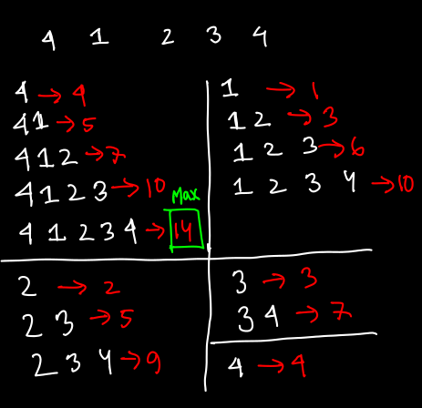
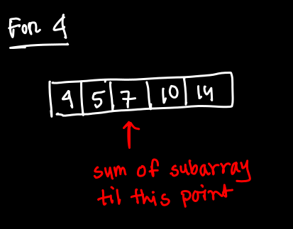

# problem solving study

### Table of Contents
---
- Data Structures
- Mathematics
- Bitwise Manipulation
- Subarray 
---

[Kadane's Algorithms](#kadanes-algorithm)


# Algorithms

## Kadane's Algorithm


**Usecase :**
You are given an array of elements that might contains some negative values and you have to find out the maximum sum which can be produced by any of the sub array built from the given array of elements.


```
Input : -2,-3,4,-1,-2,1,5,-3
Output : 7  (which can be produced from [4,-1,-2,1,5])
```  

1. *Bruteforce Approach*
	 - 
```  

#include <algorithm>
#include<bits/stdc++.h> 
#include <climits>
using namespace std;
typedef long long int lli;
#define MOD 1000000007

/* O(n^3) solution this can give TLE easily */
int maxSubarray(vector<int> nums){
    int n = nums.size();
    int sum = INT_MIN;
    for(int i =0;i<n;i++){
        for(int j=i;j<n;j++){
            int sum_now= 0;
            for(int k = i;k<=j;k++){
                sum_now += nums[k];
            }
            cout << sum_now << "\n";
            sum = max(sum, sum_now);
        }
    }

    return sum;
}


int main(){
    ios_base::sync_with_stdio(0);
    cin.tie(0);
    int n;
    cin >> n;
    vector<int> v(n);

    for(int i =0;i<n;i++){
        cin >> v[i];
    }

    cout << maxSubarray(v)<<"\n";
}

```

2. *Calculating cumulative sum / prefix sum approach*

In bruteforce approach we're calculating the sum of each possible sub array. This sum calculation can be reduced as when we are calculating sum for another subarray under one element we're just adding the next number to the previous sum. below figure showing for only an element 4.
+ 

```
#include<bits/stdc++.h> 
using namespace std;
typedef long long int lli;
#define MOD 1000000007

/* solution of O(n^2) this also gives TLE in Leetcode */
int maxSubarray(vector<int> v){
    int n = v.size();
    int max_sum = INT_MIN;
    for(int i =0;i<n;i++){
        vector<int> pref_sum;
        int sum_now = 0;
        for(int j = i;j<n;j++){
            sum_now+= v[j];
            pref_sum.push_back(sum_now);
        }
        int m = pref_sum.size();

        /* for(int x: pref_sum) cout << x << " "; */
        cout << "\n";
        for(int k = 0;k<m;k++){
            max_sum = max(max_sum, pref_sum[k]);
        }
    }

    return max_sum;
}

int main(){
  	ios_base::sync_with_stdio(0);
    cin.tie(0);
    int n;
    cin >> n;
    vector<int> v(n);

    for(int i =0;i<n;i++){
        cin >> v[i];
    }

    cout << maxSubarray(v)<<"\n";
}

```

3. *The Kadane's Algorithm*

- Traversing from left to right
- add one element to the sum
- store the sum in maxSum if sum is greater
- Not taking any negative sum further it has no use so if sum is negative make it zero

```
#include<bits/stdc++.h> 
using namespace std;
typedef long long int lli;
#define MOD 1000000007


/* TC of this solution is )(n) -> optimal one */
/* kadane algorithm */
int maxSubarray(vector<int> v){
    int msum = INT_MIN;
    int sum = 0;
    for(int i:v){
        sum+= i;
        msum = max(msum,sum);
        sum = max(sum,0);  
    }
    return msum;
}

int main(){
    ios_base::sync_with_stdio(0);
    cin.tie(0);
    int n;
    cin >> n;
    vector<int> v(n);

    for(int i =0;i<n;i++){
        cin >> v[i];
    }

    cout << maxSubarray(v)<<"\n";
}

```