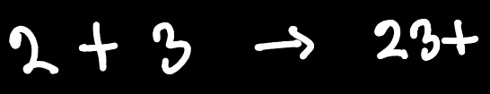
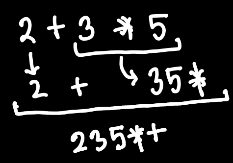
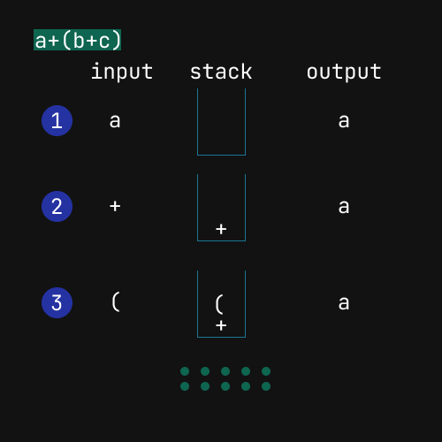
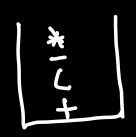
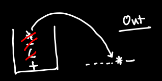

## Expression Parsing Using Stack
---

#### Precedence of the operators
1. () {} []  
2. ^  Right to Left
3. (/), (*) Left to Right
4. (-), (+) Left to Right
#### Rules for converting infix to another form
1. Maintain precedence. Operation with higher precedence will be occured first.
2. If precedence is same check associativity	


#### Infix to Postfix Conversion
1. operands will go to last for one particular operation \

2. for more than one operation precedence will be followed \


## Infix to Postfix Conversion Using Stack
*Rules*\
1. Operands will go to the output directly without any operation <br>
2. if the stack is empty or stack top is an opening bracket then operator will be pushed to the stack.<br>
3. If the incoming symbol is '(' then it will be pushed to the stack always.<br>

	

4.  If the incoming symbol is ')' then pop the stack send the symbols to the output until its opening one '('.<br>
For example, if the stack is like this<br>
	 <br>
	and the incoming symbol is ')' then <br>
	  <br>
	parenthesis will not go to the output<br>

5. If the incoming symbol has higher precedence than the top of the stack then it will be pushed to the stack else pop the stack and send to the output until you get symbol with lower precedence or stack becomes empty and lastly push the incoming symbol.
	+ higher precedence than top of the stack : pushed to the stack
	+ lower precedence than top of the stack : pop the stack and send to the output until getting symbol with lower precedence or stack becoming empty then push

<br>
<em>While popping from stack because input has lower precedence isn't there a case where a '(' can come in the road and then what to do?</em>
<p>:: It won't happen. analyze this infix expression <br>$2+3*4*(6*3+2)$</p>
<br>
<br>
<br>
6. If the incoming symbol has the same precedence of the top of the stack then check associativity rule. 
	+ For Left to Right follow the rule of lower precedence
	+ For Right to Left follow the rule of higher precedence

*Reading the input from left to right*

Input : `a+b*c-((a-b)*c)+(a+b)`

Output : *(empty)*

```
in> a+b*c-((a-b)*c)+(a+b)
stack > (empty)
out> `a`

in > +b*c-((a-b)*c)+(a+b)
stack > +
out > a

in > b*c-((a-b)*c)+(a+b)
stack > +
out > ab

in > *c-((a-b)*c)+(a+b)
stack > +*    // * > +
out > ab

in > c-((a-b)*c)+(a+b)
stack > +*
out > abc

in > -((a-b)*c)+(a+b)
stack > -
out > abc*+   // - < * and for (-) and (+) left to right associativity

in > ((a-b)*c)+(a+b)
stack > -(
out > abc*+

in > (a-b)*c)+(a+b)
stack > -((
out > abc*+

in > a-b)*c)+(a+b)
stack > -((
out > abc*+a

in > -b)*c)+(a+b)
stack > -((-
out > abc*+a

in > b)*c)+(a+b)
stack > -((-
out > abc*+ab

in > )*c)+(a+b)
stack > -(
out > abc*+ab-

in > *c)+(a+b)
stack > -(*
out > abc*+ab-

in > c)+(a+b)
stack > -(*
out > abc*+ab-c

in > )+(a+b)
stack > -
out > abc*+ab-c*

in > +(a+b)
stack > +
out > abc*+ab-c*-

in > (a+b)
stack > +(
out > abc*+ab-c*-

in > a+b)
stack > +(
out > abc*+ab-c*-a

in > +b)
stack > +(+
out > abc*+ab-c*-a

in > b)
stack > +(+
out > abc*+ab-c*-ab

in > )
stack > +
out > abc*+ab-c*-ab+

in > (empty)
stack > 
out > abc*+ab-c*-ab++
```

## Evaluation of Postfix Expression
*Rules*<br>
*input will be from left to right*
- if operand is encountered : pushed to the stack
- if operator is encountered : pop 2 ele from stack
	+ A : top element
	+ B : Next top element
	+ then do B operator A and push result to the stack
- stack top is the final evaluated result

```
Input : 23-21*+
Stack : 2

Input : 3-21*+
Stack : 2 3  

Input : -21*+
Stack : -1 

Input : 21*+
Stack : -1 2

Input : 1*+
Stack : -1 2 1

Input : *+
Stack : -1 2

Input : +
Stack : 1
```
